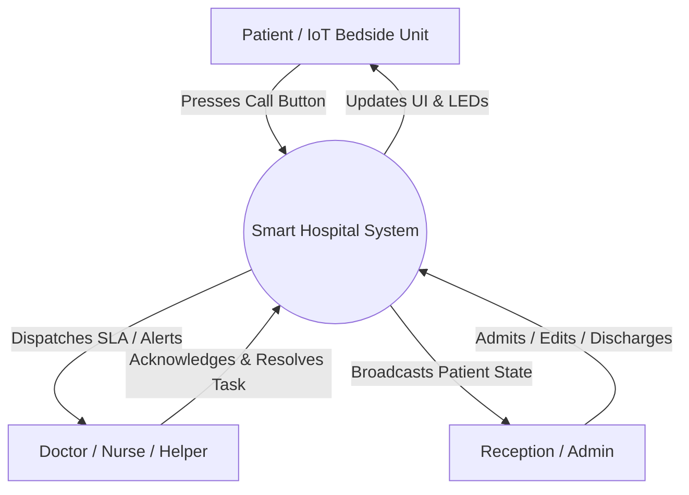
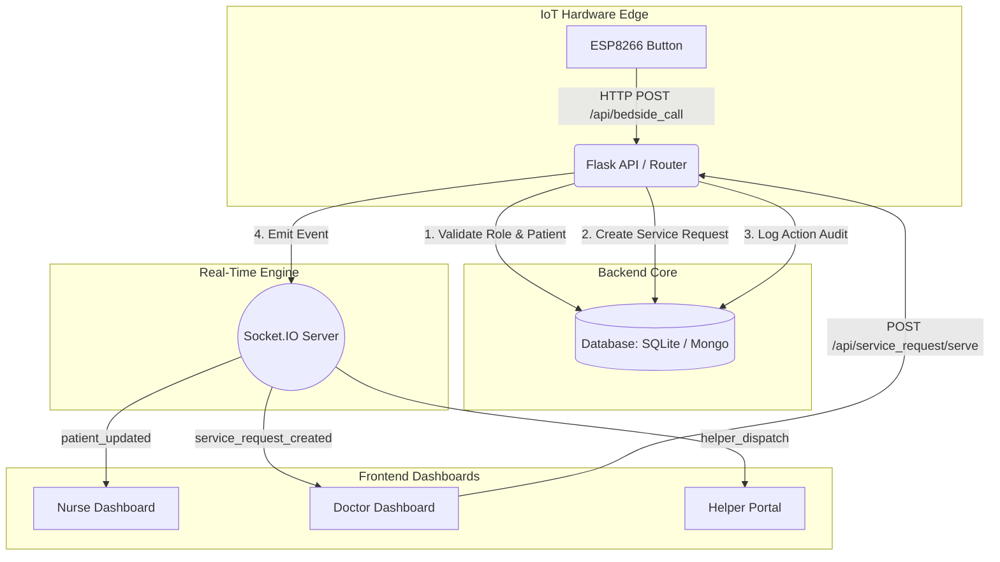

# Technical Project Proposal: Smart Hospital Patient Management & Advanced Nurse Call System (R&D)

## 1. Executive Summary
This proposal outlines the research, development, and implementation of a next-generation **Smart Hospital Patient Management & Nurse Call System**. By converging Internet of Things (IoT) hardware with real-time web technologies, the system solves critical delays in patient care. It introduces an advanced Service Level Agreement (SLA) engine, strict role-based task delegation, and comprehensive audit logging to ensure accountability and maximize clinical efficiency.

## 2. Problem Statement
Traditional hospital ward management suffers from severe bottlenecks:
- **Alert Fatigue & Misallocation:** All bedside alerts go to a central nursing station, often distracting clinical staff with non-medical requests (e.g., water, cleaning).
- **Lack of Accountability:** Traditional systems lack granular SLA tracking and audit trails. When an alert is resolved, it is often unclear who resolved it and how long it took.
- **Data Silos:** Hardware bedside units operate independently of the software-based patient record system, preventing unified analytics.

## 3. Core R&D Ideas & Innovation
To address these challenges, this system pioneers the following concepts:
- **Role-Based IoT Dispatching:** Physical bedside buttons explicitly categorize requests (Doctor Emergency, Nurse Call, General Help) and route them *only* to the authorized personnel's dashboard.
- **Collaborative SLA Resolution:** Tasks requiring multiple departments (e.g., Doctor + Nurse + Helper) are tracked as a unified SLA, remaining active until *all* assigned roles have completed their part.
- **Zero-Latency State Sync:** Utilizing WebSockets, the entire hospital network (IoT hardware, Reception, Doctor tablets, Nurse stations) remains perfectly synchronized without requiring manual page refreshes.

## 4. Key Features
- **Centralized Live Dashboard:** A color-coded grid mapping the entire ward, rendering live patient health statuses (Stable, Watch, Critical) and active alerts.
- **Intelligent SLA Engine:** Service requests feature strict countdown timers. Overdue tasks trigger visual breaches (`🚨 SLA BREACHED`), while met tasks log compliant response times.
- **Patient Lifecycle Management:** End-to-end tracking from admission to discharge, with seamless ward transfers and real-time bed reallocation.
- **Hardware-Software Handshakes:** ESP8266 microcontrollers allow physical button presses to trigger digital SLAs, and digital dashboard acknowledgments to control physical bedside LEDs.
- **Immutable Action Logs:** Every status change, SLA resolution, and patient edit is meticulously logged with the actor's Name, Role, Timestamp, and previous data state.

## 5. Technical Components & Stack

### 5.1. Software Architecture
- **Backend Framework:** Python (Flask)
- **Real-time Communication:** Flask-SocketIO (WebSockets)
- **Database:** Polyglot persistence supporting both **SQLite** (lightweight edge deployments) and **MongoDB** (scalable cloud deployments).
- **Frontend UI:** Vanilla JavaScript, HTML5, and pure CSS (zero heavy dependencies for maximum performance on low-end hospital terminals).

### 5.2. Hardware Architecture (IoT Bedside Unit)
- **Microcontroller:** ESP8266 / ESP32 (Wi-Fi enabled).
- **Inputs:** Dedicated tactile push-buttons for varied emergencies (Red: Doctor, Yellow: Nurse, Green: Helper).
- **Outputs:** Status LEDs providing immediate feedback to the patient that help is en route.

---

## 6. Conceptual Data Flow Diagrams (DFD)

### Level 0: Context Diagram

### Level 1: Process Diagram

---

## 7. Future R&D Scope & Enhancements
1. **AI-Driven Predictive Triage:** Analyzing historical SLA data and admission causes to predict peak alert times and automatically suggest staff reallocations.
2. **Wearable Integrations:** Connecting Bluetooth Low Energy (BLE) vital monitors (SpO2, Heart Rate) directly to the ESP8266 nodes to automate the "Health Condition" metrics in real-time.
3. **Heatmap & Route Optimization:** Implementing indoor positioning for staff to automatically clear alerts when the assigned staff member's RFID/BLE tag enters the patient's room.
