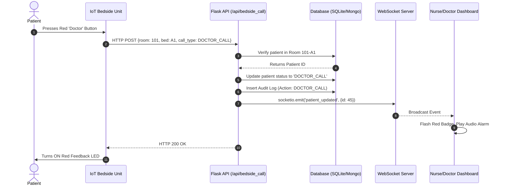

# Technical Architecture & Operational Examples
**Smart Hospital Patient Management & Nurse Call System**

---

## 1. Architectural Overview
The system employs a **hybrid edge-cloud architecture**. It is designed to run reliably on local hospital networks (edge) via SQLite while supporting seamless scaling to cloud infrastructure via MongoDB. Real-time synchronization is achieved through an event-driven WebSocket layer bridging physical hardware (IoT) and software dashboards.

### 1.1 Core Layers
1. **Presentation Layer (Frontend):** 
   - Built with pure HTML5, CSS3, and Vanilla JavaScript. 
   - No heavy frameworks (like React or Angular) to ensure sub-second load times on low-power hospital thin clients.
2. **Event & API Layer (Backend):** 
   - Powered by **Python (Flask)**.
   - Dual-channel communication: **REST API** for CRUD operations (Admission, SLA updates) and **Flask-SocketIO** for bi-directional, zero-latency state broadcasts.
3. **Persistence Layer (Database):** 
   - An abstraction wrapper allows hot-swapping between **SQLite** (for disconnected edge deployments) and **MongoDB** (for enterprise-scale cloud deployments).
4. **Hardware Layer (IoT Edge):** 
   - **ESP8266 / ESP32** Microcontrollers acting as Bedside Units. They interface with the API via standard HTTP POST payloads.

---

## 2. Core Data Models
The architecture relies on several interconnected entities to maintain system state:

* **Patients (`patients`)**: The core entity tracking `room_no`, `bed_no`, `health_condition`, and lifecycle `status` (NORMAL, IN_TREATMENT, DISCHARGED).
* **Service Requests (`service_requests`)**: The SLA engine tracking `target_roles` (Doctor, Nurse, Helper), `target_minutes`, and `solved_by_roles` (Array).
* **Audit Logs (`action_logs`)**: Immutable ledger tracking every system change, recording the `timestamp`, `staff_name`, `staff_role`, and the delta of the change.

---

## 3. System Sequence Diagrams

### 3.1 Hardware-to-Dashboard Sequence
This diagram illustrates the operational flow when a patient presses a physical emergency button on the ESP8266 bedside unit.

---

## 4. Operational Examples

Below are concrete, step-by-step examples of how the technical architecture handles complex hospital workflows.

### Operational Example A: Multi-Role SLA Resolution
**Scenario:** A doctor orders a complex procedure requiring a Doctor, Nurse, and General Helper. The SLA target is 15 minutes.

1. **Creation (REST):** The Doctor submits the request via the UI. An HTTP POST is sent to `/api/service_request/create`.
2. **Allocation (DB):** The backend generates a unique tracking ID (e.g., `ICU/20260913/001`) and saves the request with `target_roles = ["Doctor", "Nurse", "General Helper"]` and `status = 'PENDING'`.
3. **Broadcast (WS):** The WebSocket server emits `service_request_created`. All active dashboards instantly render the new SLA card with a live countdown timer.
4. **Partial Resolution (REST):** The Nurse completes their part and clicks "Mark Served". 
   - Backend verifies the user is a Nurse.
   - Appends "Nurse" to the `solved_by_roles` array.
   - Changes status from `PENDING` to `IN_PROCESS`.
   - Logs: *"SLA TASK PARTIALLY SOLVED [ICU/20260913/001]... Pending from: Doctor, Helper"*.
5. **UI Update (WS):** The UI receives the update, strikes through the "Nurse" badge on the card, and leaves Doctor and Helper active.
6. **Final Resolution:** Once the Doctor and Helper also click "Mark Served", the array matches the `target_roles`. The status changes to `SERVED`, the SLA timer stops, and the task is archived.

### Operational Example B: Dynamic Patient Admission & Editing
**Scenario:** The Receptionist admits a new patient and later realizes the room number was typed incorrectly.

1. **Admission:** Receptionist uses the "Register New Patient" modal. An HTTP POST is sent to `/api/patient/add`.
   - The database creates the patient record with default `status = NORMAL`.
   - The backend links the patient to a virtual (or physical) ESP MAC address based on the Room/Bed combination.
2. **Correction (Editing):** The Receptionist clicks the ✏️ **Edit** button.
   - They change "Room 105" to "Room 106".
   - An HTTP POST is sent to `/api/patient/edit`.
3. **Audit Trail Generation:**
   - The Python backend compares the old dictionary `{room: 105}` with the incoming dictionary `{room: 106}`.
   - It detects the delta and generates a precise log string: `"Edited details: Room: 105 -> 106"`.
   - The UI immediately shifts the patient's card to the new room grouping via WebSocket trigger.

### Operational Example C: Hardware Acknowledgment Loop
**Scenario:** A Nurse is walking down the hallway and sees the flashing red LED on a bedside unit.

1. **Hardware Acknowledgment:** Instead of walking back to the computer station, the Nurse presses the physical **"Ack/Reset"** button on the bedside ESP8266.
2. **API Trigger:** The ESP sends a POST request to `/api/bedside_reset`.
3. **State Clear:** The backend clears the active `DOCTOR_CALL` or `NURSE_CALL`, reverting the patient to `NORMAL` (or `IN_TREATMENT`).
4. **Bi-Directional Sync:** 
   - The API tells the ESP8266 to turn off its physical flashing LEDs (Hardware sync).
   - The API emits a WebSocket event telling the central dashboard to stop flashing red and silence the alarm audio (Software sync).
